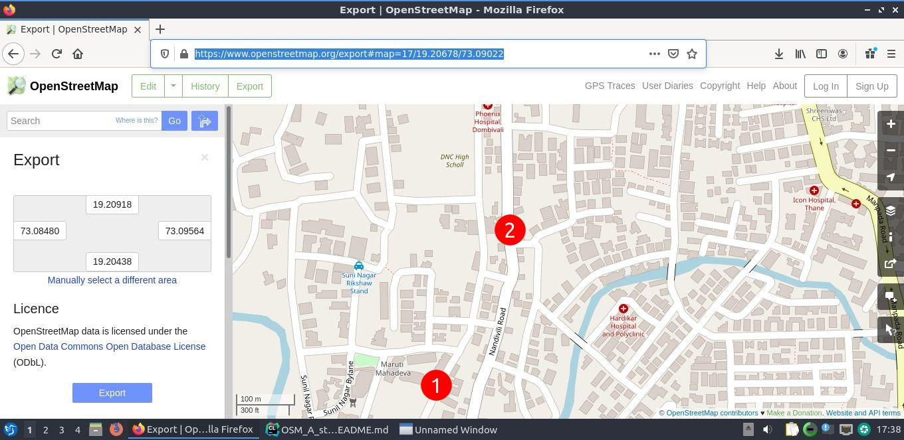
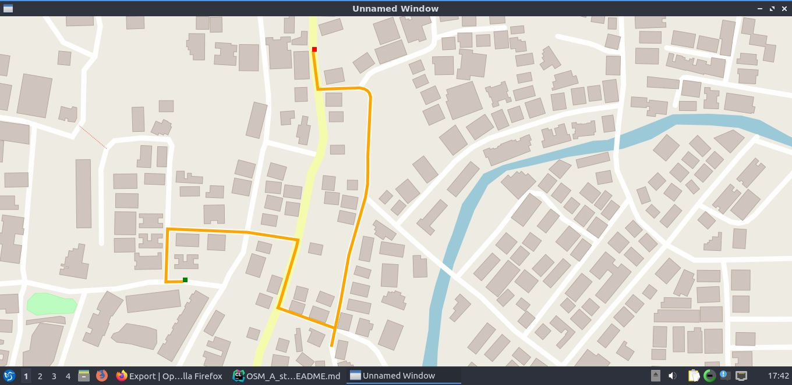
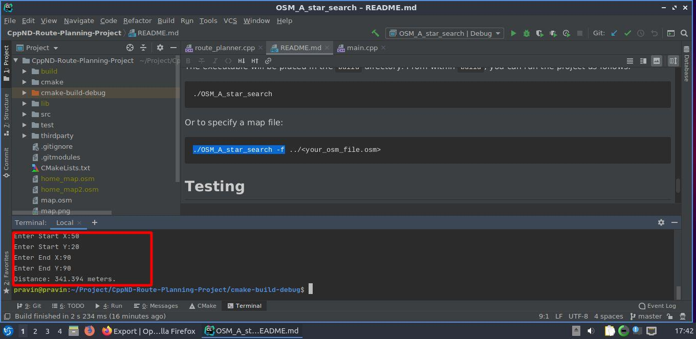

# Route Planning Project

This repo contains code for the Route Planning project. This Project uses A Star Algorithm to find the 
shortest route between two point on map. Open Street Map file(.osm) is used as input data for the algorithm.

Sample Example:
## Map of my Area
`Point 1` - is my start point(home) and `Point 2` - is destination (tv repair shop).


## Route planned by Algorithm
Algorithm read (.osm) file imported from Open Street map as Export file and found the path. From my experience, it is 
nearly good route to reach there but not the best. If I have to make choice it will be second in the list. So, this
Algorithm work quite nicely in my case.


## Distance Estimated by the Algorithm
I haven't really measured this distance. but, it is ok as shop is not too far and `340 meters` is not unrealistic.



## Cloning

When cloning this project, be sure to use the `--recurse-submodules` flag. Using HTTPS:
```
git clone https://github.com/pravinyo/cpp_learning.git --recurse-submodules
```
or with SSH:
```
git clone git@github.com:udacity/cpp_learning.git --recurse-submodules
```

## Dependencies for Running Locally
* cmake >= 3.11.3
  * All OSes: [click here for installation instructions](https://cmake.org/install/)
* make >= 4.1 (Linux, Mac), 3.81 (Windows)
  * Linux: make is installed by default on most Linux distros
  * Mac: [install Xcode command line tools to get make](https://developer.apple.com/xcode/features/)
  * Windows: [Click here for installation instructions](http://gnuwin32.sourceforge.net/packages/make.htm)
* gcc/g++ >= 7.4.0
  * Linux: gcc / g++ is installed by default on most Linux distros
  * Mac: same instructions as make - [install Xcode command line tools](https://developer.apple.com/xcode/features/)
  * Windows: recommend using [MinGW](http://www.mingw.org/)
* IO2D
  * Installation instructions for all operating systems can be found [here](https://github.com/cpp-io2d/P0267_RefImpl/blob/master/BUILDING.md)
  * Run - `sudo make install` in debug folder to make io2d visible to project
  * This library must be built in a place where CMake `find_package` will be able to find it

## Compiling and Running

### Compiling
To compile the project, first, create a `build` directory and change to that directory:
```
mkdir build && cd build
```
From within the `build` directory, then run `cmake` and `make` as follows:
```
cmake ..
make
```
### Running
The executable will be placed in the `build` directory. From within `build`, you can run the project as follows:
```
./OSM_A_star_search
```
Or to specify a map file:
```
./OSM_A_star_search -f ../<your_osm_file.osm>
```

## Testing

The testing executable is also placed in the `build` directory. From within `build`, you can run the unit tests as follows:
```
./test
```

